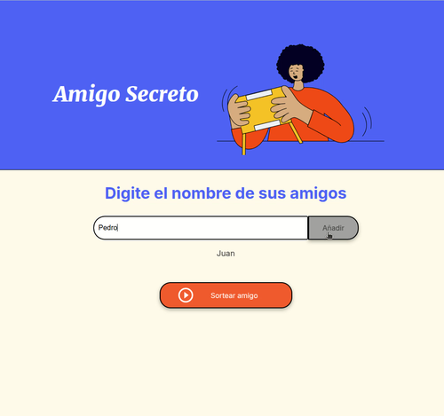

# Readme: Practicando Lógica de Programación: Challenge Amigo secreto
## Alura Latam & ONE

### **Objetivo**
Desarrollar una aplicación web para el ingreso de nombres. Dicha aplicación debe sortear uno sólo nombre entre todos los ingresados y publicarlo en la misma página web.

#### **Lenguajes Utilizados**
* Para el desarrollo de este proyecto se utilizó HTML, CCS y JavaScript

#### **Instalación**

* Para observar su funcionamiento debe bajar todos las carpetas y archivos a un mismo directorio, luego llamar el archivo index.html a través de cualquier navegador.
    
#### **Instrucciones**

1. Ingresar un nombre en el recuadro que dice *Escribe un nombre*
2. Una vez digitado el nombre, presionar el botón *Añadir*
3. El nombre debe contener solamente letras.
4. Si el nombre esta bien ingresado, aparecerá en la parte de abajo del recuadro.
5. En caso, de que el nombre ingresado, tenga algún número o este vacío, se dará una alerta de que fue mal ingresado.
7. Ese ingreso no será valido y deberá volver a ingresarlo correctamente.
8. El botón "Sortear Amigo" estará deshabilitado hasta que al menos halla ingresado dos nombres.
9. Una vez ingresado todos los nombres, se presiona el botón *Sortear amigo*
10. El programa, escogerá aleatoriamente un nombre de la lista y publicará el siguiente mensaje: *El amigo secreto sorteado es: nombre-elegido-aletoriamente*
11. Una vez realizado el sorteo, el botón "Sortear Amigo" quedará deshabilitado y el botón "Reiniciar Sorteo" se habilitará.
12. Cuando presione el botón "Reiniciar Sorteo", la página se reinicia. Podrá, nuevamente, ingresar nombres y volver a realizar un nuevo sorteo.

En el siguiente video se muestra como se debe ingresar los nombres, los posibles problemas (al ingresar mal los datos) y cómo generar el Amigo Secreto:

#### **Mejoras al Sistema**

Este challanger, se ha resuelto según las especificaciones entregadas. Sin embargo, se puede mejorar en varios aspectos:

1. Si, a pesar de que todas son letras, puede haber letras en mayúsculas entre medio del nombre, lo que no da un buen aspecto en la visualización de los mismos.

3. La posibilidad que se tengan amigos con el mismo nombre, por lo que podría habilitarse el ingreso de apellidos para una mejor diferenciación.

4. Imprimir en pantalla el número de amigos añadidos.
